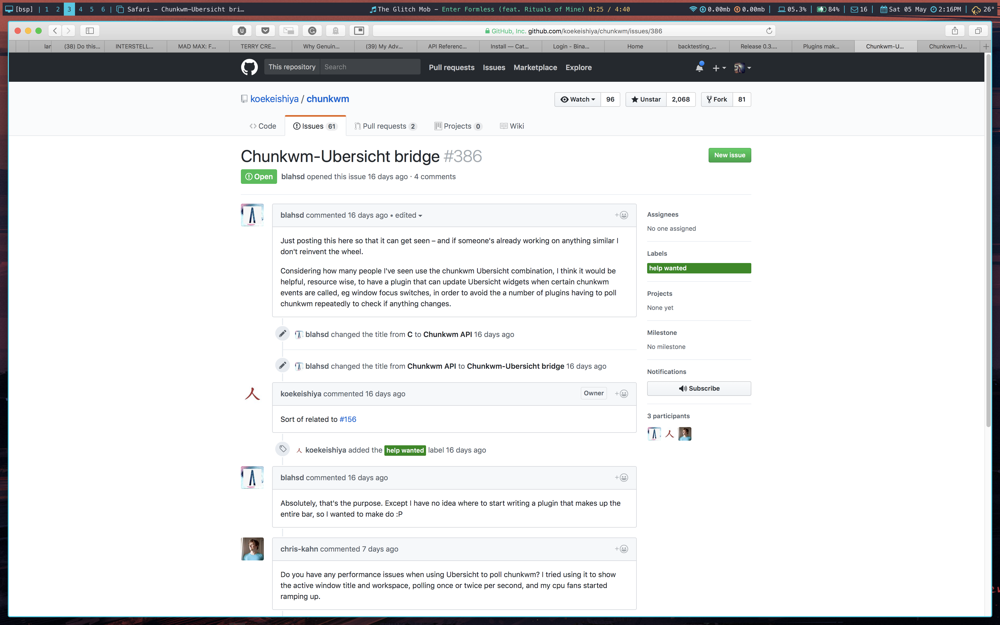

# nerdbar.widget

This is a fork from the version created by [Apierz](https://github.com/apierz/nerdbar.widget) - collectively we've added a lot of random stuff to these bars so a lot of credit goes to him.

A lot of the changes have been purely cosmetic - but I have added a few small things.

After a little while of cobbling together my old bar and Apierz new bar, I present my version of nerdbar!

This [Übersicht](http://tracesof.net/uebersicht/) bar is intended to be used with the [Kwm](https://github.com/koekeishiya/kwm) window manager and designed with colors from the [Oceanic Next](https://github.com/voronianski/oceanic-next-color-scheme) colour scheme.

The original bar is by [Herrbischoff](https://github.com/herrbischoff/nerdbar.widget).

## Installation
Place the master folder in the **Übersicht Widget Directory** or if you want to only install one or a few of the widgets, just remove them from "Betterbar-master" and put them in the Widget Directory. Issues may arise regarding the scripts, so it may be worth taking everything out of the master file and placing it all directly in the Widget Directory.

### Widgets

#### background.coffee

Basic black bars for the widgets to sit on top of. Not much to see here.

#### mode.coffee / currentWindow.coffee

This widget is designed to work with KWM. It shows the current KWM mode (bsp, float, monocle) and the number of desktops and the current one.

#### stats.coffee

Identical to Apierz version. Again, [check his one out.](https://github.com/apierz/nerdbar.widget)

#### status.coffee / weather.coffee

Pretty much identical to my old version but compressed into one widget. Internet icon will tell you if you're wired or not and what you're connected to.

#### iTunes.coffee

Finally something new!

This attaches to iTunes/Apple Music and tells you what song is playing by who and where you are in the song as well as whether it's paused or not.

This can also work with spotify if you change the word 'itunes' in 'itunes.sh' to 'spotify'.

### Upcoming

* still trying to work out the iMessage thing for a widget. It's not very well documented.

I use the San Francisco Mono typeface which I can't actually distribute here, but if you're on Sierra or above you should already have it. Or you could just change it.

Also [FontAwesome](http://fontawesome.io) for the icons and [All-the-icons](https://github.com/domtronn/all-the-icons.el) for the weather icons. 

You'll need these installed for stuff to work.